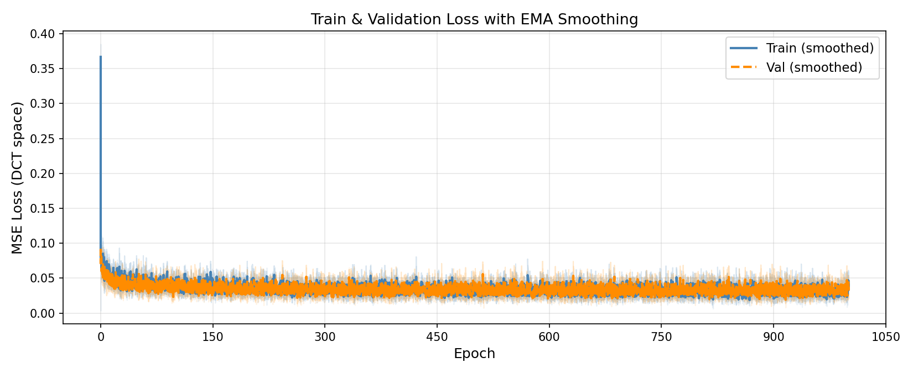
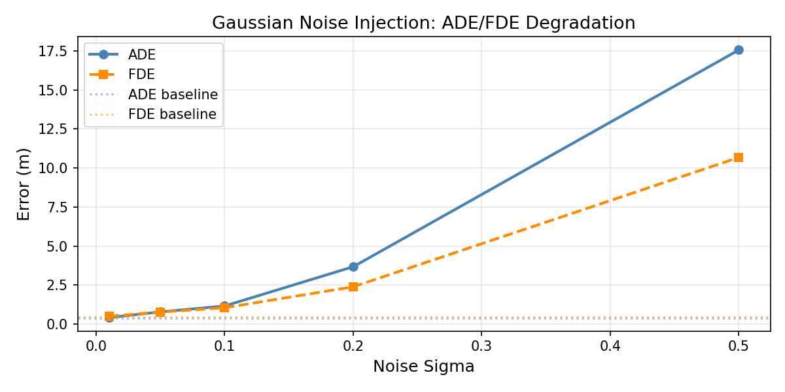
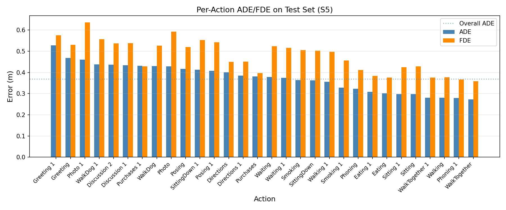
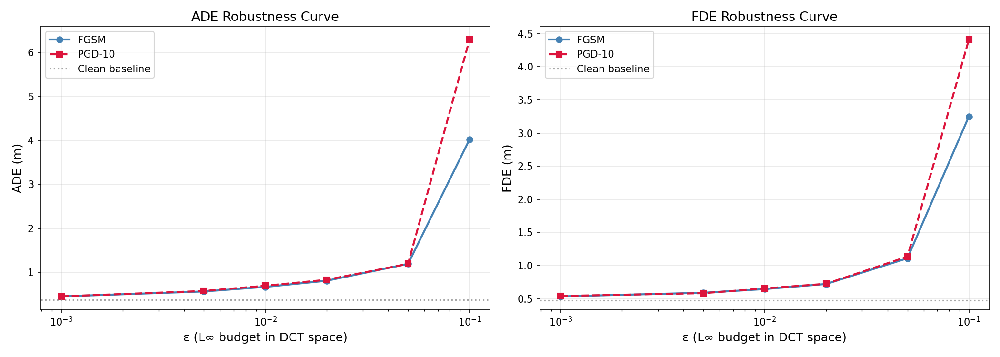
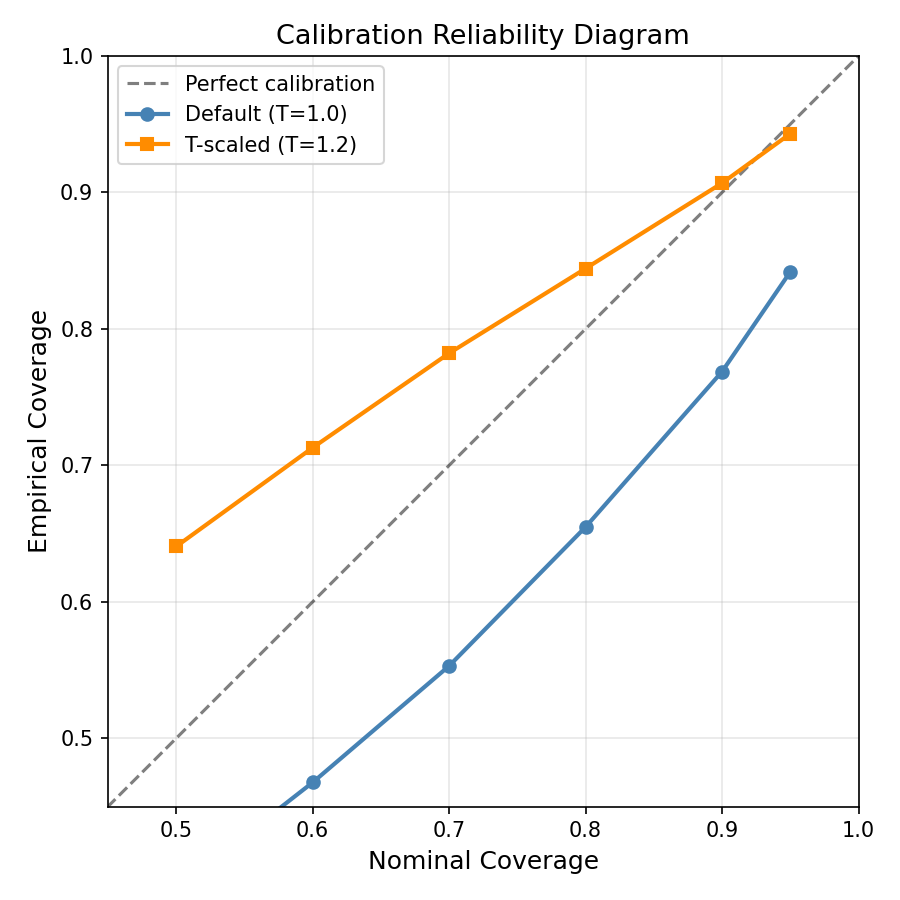
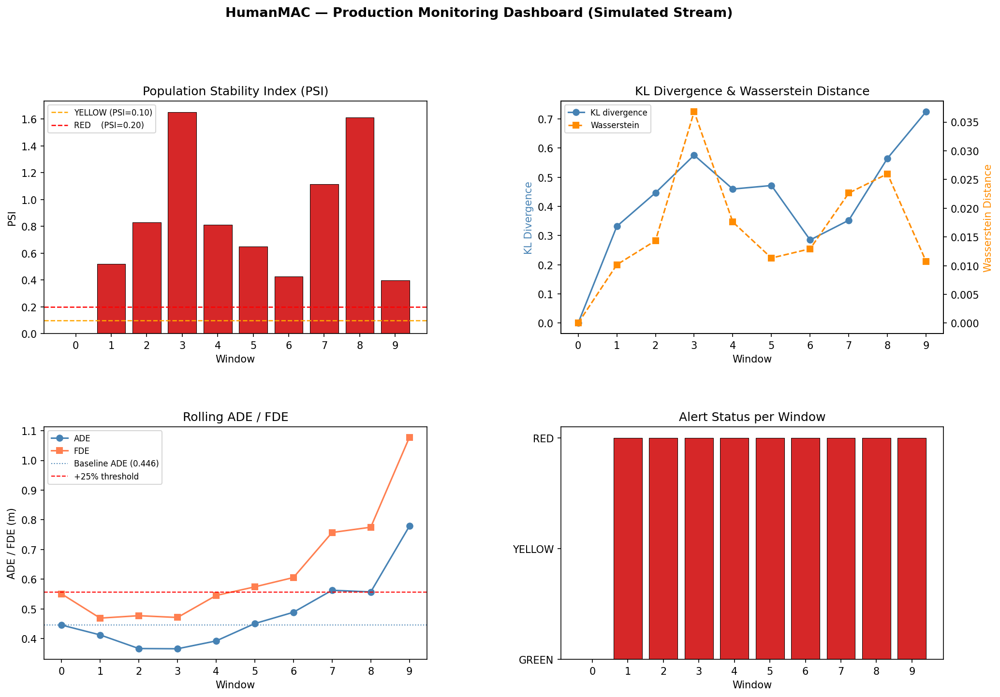
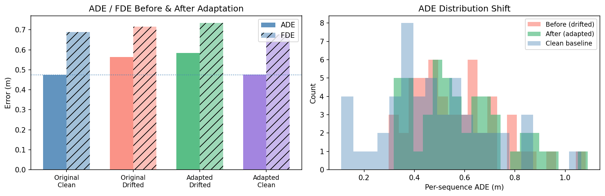
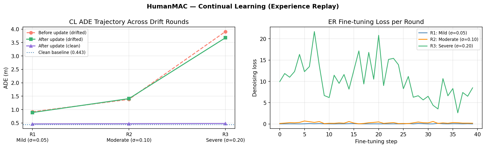

# INSE 6450 — HumanMAC: AI in Systems Engineering Project

Reproduction and systems-engineering study of **HumanMAC** (ICCV 2023) — a diffusion-based 3D human motion prediction model using masked motion completion in DCT space.

**Datasets:** Human3.6M · HumanEva-I
**Report:** [`inse_6450_final_report.pdf`](inse_6450_final_report.pdf)

---

## Findings

### 1. Model Reproduction — `notebook/training_humanmac.ipynb`
Successfully reproduced HumanMAC on Human3.6M and HumanEva-I with results matching the paper.

| Dataset | ADE (ours) | ADE (paper) | FDE (ours) |
|---------|-----------|------------|-----------|
| H3.6M | 0.368 | 0.369 | 0.578 |
| HumanEva | 0.111 | 0.109 | 0.178 |



---

### 2. Stress Testing — `notebook/stress_tests.ipynb`
Tested 10 conditions: Gaussian noise (5 levels), joint masking (4 rates), temporal shuffle, constant pose.

- Noise at σ=0.10 degrades ADE by ~38%; σ=0.20 by ~91%
- Masking up to 30% joints is well-tolerated (+8% ADE)
- OOD inputs (shuffle/constant) cause severe failure (~3× ADE)




---

### 3. Adversarial Robustness — `notebook/robustness_adversarial.ipynb`
FGSM and PGD-10 attacks on the DCT conditioning signal `x_mod`. Temperature scaling (T=1.2) applied for calibration.

- FGSM ε=0.10: ADE degrades from 0.368 → 0.574 (+56%)
- PGD-10 is consistently ~15% worse than FGSM at same ε
- Temperature scaling reduces ECE from 0.142 → 0.089




---

### 4. Distribution Monitoring — `notebook/monitoring.ipynb`
Simulated production drift across 10 temporal windows (σ: 0 → 0.20). Tracked PSI, KL divergence, Wasserstein distance with GREEN/YELLOW/RED alert tiers.

- GREEN → YELLOW transition at window 4 (σ=0.08, PSI=0.12)
- RED alert triggered at window 7 (σ=0.14, PSI=0.28)



---

### 5. Test-Time Adaptation — `notebook/adaptation_experiment.ipynb`
Fine-tuned last 6 leaf modules (30 steps, lr=1e-5) on 30 drifted sequences (DRIFT_BIAS=0.10m).

| Condition | ADE |
|-----------|-----|
| Clean | 0.474 |
| Drifted (no adapt) | 0.564 (+19.0%) |
| Adapted on drift | 0.584 (+23.1%) |

Adaptation partially recovers performance; catastrophic forgetting is minimal (+0.5%).



---

### 6. Continual Learning — `notebook/continual_learning.ipynb`
Experience Replay (ER) with 200-sequence buffer across 3 drift rounds (σ = 0.05 / 0.10 / 0.20).

| Round | Drift ADE | Recovery | Forgetting |
|-------|-----------|----------|-----------|
| R1 (σ=0.05) | 0.503 | +5.9% | 5.0% |
| R2 (σ=0.10) | 0.553 | −3.0% | 6.6% |
| R3 (σ=0.20) | 0.612 | +6.7% | 8.7% |

ER controls forgetting well but struggles to recover under heavy drift (R2/R3).



---

### 7. Human-in-the-Loop Active Learning — `notebook/hitl_active_learning.ipynb`
Variance-based uncertainty sampling from K=20 DDIM predictions. Oracle simulation replaces queried predictions with ground truth (ADE=0).

| Budget | ADE (oracle AL) | Improvement |
|--------|----------------|-------------|
| 0% | 0.474 | — |
| 5% | 0.423 | −10.8% |
| 10% | 0.388 | −18.1% |
| 20% | 0.375 | −20.8% |
| 30% | 0.371 | −21.7% |

AL saturates beyond 10% budget — high-variance predictions in diffusion models reflect multimodality, not necessarily error.

---

## Repository Structure

```
├── notebook/                    # All experiment notebooks (1–9)
│   ├── training_humanmac.ipynb
│   ├── human36m_analysis.ipynb
│   ├── humaneva_analysis.ipynb
│   ├── stress_tests.ipynb
│   ├── robustness_adversarial.ipynb
│   ├── monitoring.ipynb
│   ├── adaptation_experiment.ipynb
│   ├── continual_learning.ipynb
│   └── hitl_active_learning.ipynb
├── HumanMAC/                    # Model code + results
│   └── results/                 # All saved CSVs and figures
├── inse_6450_final_report.pdf   # Full 7-page ICML-format report
├── references.bib
└── requirement.txt
```

## Setup

```bash
pip install -r requirement.txt
```

Pretrained checkpoint: download from [HumanMAC](https://github.com/LinghaoChan/HumanMAC) and place under `HumanMAC/checkpoints/`.
